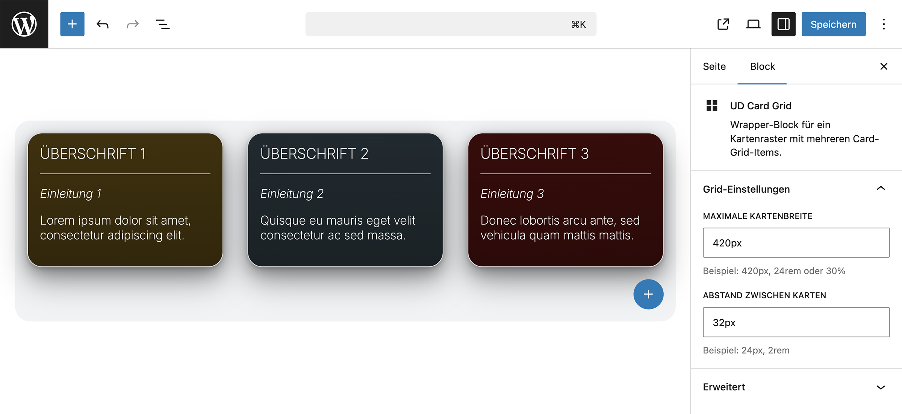

# UD Block: Card Grid

Wrapper- und Karten-Block zur Darstellung von Inhalten in einem flexiblen Raster.

---

## Übersicht

Dieses Plugin stellt zwei Blöcke zur Verfügung:

- **Card Grid (Container)**: Definiert das Raster und Layout
- **Card Grid Item (Einzelelement)**: Einzelne Karte innerhalb des Rasters

Mehrere Items können innerhalb des Containers angeordnet werden und bilden ein responsives Kartenlayout.

---

## Funktionen

- Container-Block für Kartenraster
- Frei definierbare Anzahl an Karten
- Steuerung von:
  - Abstand zwischen Karten (Gap)
  - Maximale Breite der Karten
- Karten mit:
  - Eyebrow
  - Titel
  - Text
  - Hintergrund-Variante
- Responsive Darstellung
- Anchor-Unterstützung für den Container

---

## Rendering-Kontext

**Card Grid (Container)**
- Definiert Rasterstruktur und Layout
- Gibt Layout-Werte (z. B. Gap, Max-Width) an die Items weiter :contentReference[oaicite:0]{index=0}  

**Card Grid Item (Einzelblock)**
- Nur innerhalb des Containers verfügbar :contentReference[oaicite:1]{index=1}  
- Rendert Inhalte wie Eyebrow, Titel und Text :contentReference[oaicite:2]{index=2}  

---

## Editor

- Layout wird im Container definiert
- Inhalte werden direkt in den Items gepflegt
- Texte (Eyebrow, Titel, Inhalt) direkt editierbar

---

## Frontend

Die Darstellung erfolgt als flexibles Grid mit individuell befüllbaren Karten. Styling und Verhalten werden über Theme und Block-Styles gesteuert.

---

## Technische Hinweise

- Block-Registrierung erfolgt aus dem `build/blocks`-Verzeichnis :contentReference[oaicite:3]{index=3}  
- Zwei Blöcke:
  - `ud/card-grid` (Container) :contentReference[oaicite:4]{index=4}  
  - `ud/card-grid-item` (Einzelelement) :contentReference[oaicite:5]{index=5}  
- Container übergibt Layout-Werte via Block Context an die Items :contentReference[oaicite:6]{index=6}  
- Zentrale Logik über `helpers.php`, `render.php`, `enqueue.php` :contentReference[oaicite:7]{index=7}  

---

## Autor

[ulrich.digital gmbh](https://ulrich.digital)

## Lizenz

GPL v2 or later  
https://www.gnu.org/licenses/gpl-2.0.html